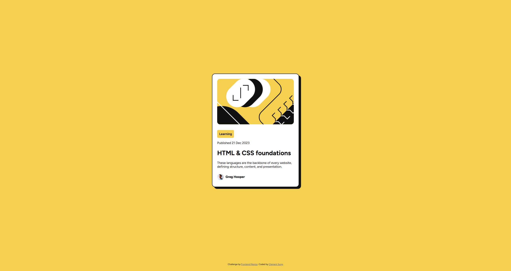

# Frontend Mentor - Blog preview card solution

This is a solution to the [Blog preview card challenge on Frontend Mentor](https://www.frontendmentor.io/challenges/blog-preview-card-ckPaj01IcS). Frontend Mentor challenges help you improve your coding skills by building realistic projects. 

## Table of contents

- [Overview](#overview)
  - [The challenge](#the-challenge)
  - [Screenshot](#screenshot)
  - [Links](#links)
- [My process](#my-process)
  - [Built with](#built-with)
  - [What I learned](#what-i-learned)
  - [Useful resources](#useful-resources)
- [Author](#author)
- [Acknowledgments](#acknowledgments)


## Overview

### The challenge

Users should be able to:

- See hover and focus states for all interactive elements on the page

### Screenshot




### Links

- Solution URL: [Add solution URL here](https://your-solution-url.com)
- Live Site URL: [Add live site URL here](https://your-live-site-url.com)

## My process

### Built with

- Semantic HTML5 markup
- CSS custom properties
- Flexbox
- CSS Grid
- Mobile-first workflow


### What I learned

I used flexbox on the main section to center the preview card element. Also, I used the clamp function to scale the font size depending on screen size without using media queries. 

```css
main {
  display: flex;
  justify-content: center;
  align-items: center;
  height: 95vh;
}

.card-container p {
  font-size: clamp(14px, 2vw, 16px);
}

.card-container h1 {
  font-size: clamp(1.5em, 2vw, 2em);
}

```

### Useful resources

- [7 CSS Responsive Sizing Features](https://www.youtube.com/watch?v=1AyiCquK8zY) - This video helped me understand different sizing features in CSS. 


## Author

- Website - [Clement Sung](https://www.clementsung.com)
- Frontend Mentor - [@clembrulee](https://www.frontendmentor.io/profile/clembrulee)
